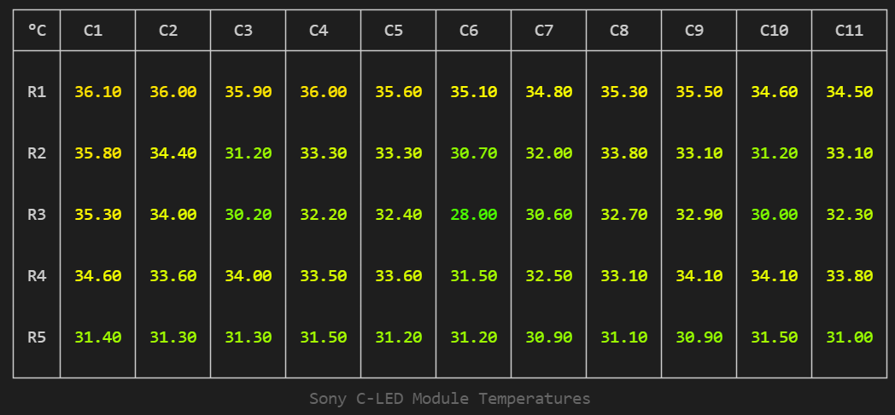

# RadiantPi.Sony.Cledis

`SonyCledisClient` enables control of a Sony C-LED (Cledis)) controller over Telnet. The library is platform agnostic and works on Windows or Linux, including on a Raspberry Pi.

Run the `dotnet` command from your project folder to add the `RadiantPi.Sony.Cledis` assembly:
```
dotnet add package RadiantPi.Sony.Cledis
```

Find a description of the latest changes in the [release notes](ReleaseNotes.md).

## Sample: Show Module Temperatures

Use `SonyCledisClient` to connect to an Sony C-LED and the module temperatures.

```csharp
using System;
using System.Linq;
using RadiantPi.Sony.Cledis;
using Spectre.Console;

// initialize client
using var client = new SonyCledisClient(new() {
    Host = "192.168.1.190",
    Port = 53595
});

// connect to device and fetch module temperatures
var temperatures = await AnsiConsole.Status()
    .Spinner(Spinner.Known.Dots)
    .StartAsync("Fetching Sony C-LED Module Temperatures", _ => client.GetTemperatureAsync());

// render module temperatures as a table
var table = new Table();
table.AddColumn("°C");
for(var column = 0; column < temperatures.ColumnCount; ++column) {
    table.AddColumn(new TableColumn($"C{column + 1}").Centered());
}
for(var row = 0; row < temperatures.RowCount; ++row) {
    var line = new string[temperatures.ColumnCount + 1];
    line[0] = $"\nR{row + 1}\n";
    for(var column = 0; column < temperatures.ColumnCount; ++column) {

        // find the highest temperature reading for each module
        var temperature = temperatures.Modules[column, row]
            .CellTemperatures
            .Append(temperatures.Modules[column, row].BoardTemperature)
            .Append(temperatures.Modules[column, row].AmbientTemperature)
            .Max();

        // render temperature with color coding
        var cell = $"\n{temperature:0.00}";
        line[column + 1] = cell;
    }
    table.AddRow(line);
}
table.Caption("Sony C-LED Module Temperatures");
AnsiConsole.Write(table);
```


## Output



## License

This application is distributed under the GNU Affero General Public License v3.0 or later.

Copyright (C) 2020-2021 - Steve G. Bjorg